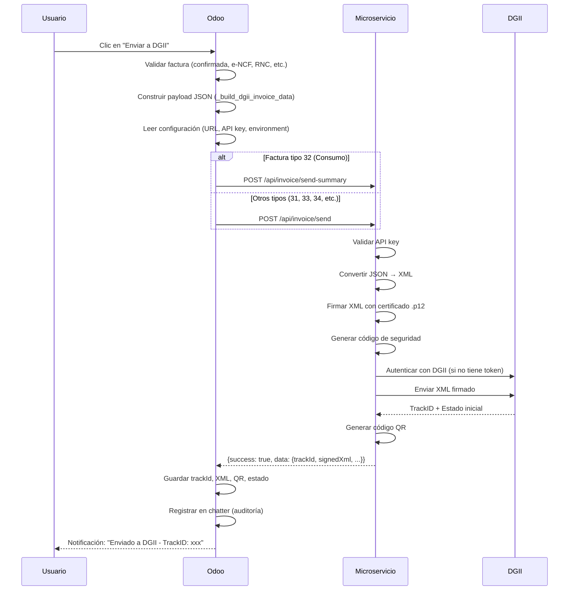
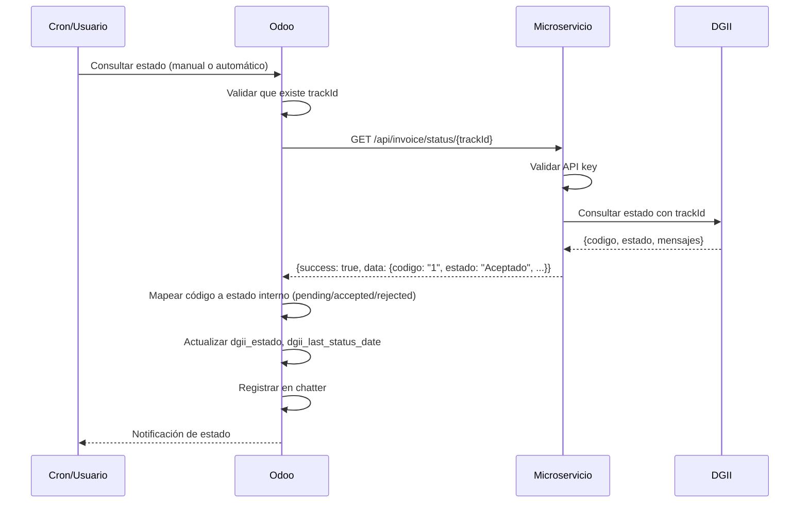

# 📘 Guía de Integración API - Módulo odoo_dgii_ecf

**Versión del Módulo**: 19.0.1.2.0
**Fecha**: 2025-12-12
**Audiencia**: Desarrolladores del Microservicio dgii-ecf
**Propósito**: Documentar las expectativas y contratos de integración entre Odoo y el microservicio

---

## 📋 Tabla de Contenidos

1. [Arquitectura de Integración](#arquitectura-de-integración)
2. [Configuración del Microservicio](#configuración-del-microservicio)
3. [Autenticación](#autenticación)
4. [Endpoints Requeridos](#endpoints-requeridos)
5. [Contratos de Datos (Request/Response)](#contratos-de-datos-requestresponse)
6. [Manejo de Errores](#manejo-de-errores)
7. [Flujos de Proceso](#flujos-de-proceso)
8. [Campos de Auditoría](#campos-de-auditoría)
9. [Casos de Prueba](#casos-de-prueba)
10. [Troubleshooting](#troubleshooting)

---

## 🏗️ Arquitectura de Integración

### Diagrama de Componentes

```
┌─────────────────────────────────────────────────────────────┐
│                      ODOO 19 ERP                             │
│  ┌────────────────────────────────────────────────────┐     │
│  │ Módulo: odoo_dgii_ecf (v19.0.1.2.0)               │     │
│  │                                                     │     │
│  │ Responsabilidades:                                 │     │
│  │ • Generación de e-NCF (formato: E310000000005)     │     │
│  │ • Construcción de payload JSON según DGII          │     │
│  │ • Gestión de rangos de secuencias                  │     │
│  │ • Validación de clientes (RNC)                     │     │
│  │ • Almacenamiento de XML firmado                    │     │
│  │ • Consulta de estados DGII                         │     │
│  │ • Auditoría completa                               │     │
│  └────────────────────────────────────────────────────┘     │
└──────────────────────┬──────────────────────────────────────┘
                       │
                       │ HTTP REST API
                       │ Content-Type: application/json
                       │ x-api-key: [opcional]
                       │
                       ▼
┌─────────────────────────────────────────────────────────────┐
│              MICROSERVICIO NODE.JS (dgii-ecf)                │
│  ┌────────────────────────────────────────────────────┐     │
│  │ Librería: dgii-ecf v1.6.8                          │     │
│  │                                                     │     │
│  │ Responsabilidades:                                 │     │
│  │ • Autenticación con DGII (obtener token)           │     │
│  │ • Conversión JSON → XML                            │     │
│  │ • Firma digital con certificado .p12               │     │
│  │ • Envío a DGII API                                 │     │
│  │ • Gestión de respuestas DGII                       │     │
│  │ • Generación de códigos QR                         │     │
│  │ • Manejo de aprobaciones comerciales               │     │
│  │ • Anulación de rangos                              │     │
│  └────────────────────────────────────────────────────┘     │
└──────────────────────┬──────────────────────────────────────┘
                       │
                       │ HTTPS
                       │ XML Firmado
                       │
                       ▼
┌─────────────────────────────────────────────────────────────┐
│                        DGII API                              │
│  • Ambiente Test:   https://ecf.dgii.gov.do/TesteCF/        │
│  • Ambiente Cert:   https://ecf.dgii.gov.do/CerteCF/        │
│  • Ambiente Prod:   https://ecf.dgii.gov.do/eCF/            │
└─────────────────────────────────────────────────────────────┘
```

### Principios de Separación de Responsabilidades

| Responsabilidad | Odoo | Microservicio |
|-----------------|------|---------------|
| Generar e-NCF | ✅ | ❌ |
| Construir JSON DGII | ✅ | ❌ |
| Validar cliente/RNC | ✅ | ❌ |
| Gestionar rangos | ✅ | ❌ |
| Convertir JSON → XML | ❌ | ✅ |
| Firmar XML digitalmente | ❌ | ✅ |
| Autenticar con DGII | ❌ | ✅ |
| Enviar a DGII | ❌ | ✅ |
| Generar código QR | ❌ | ✅ |
| Almacenar XML firmado | ✅ | ❌ |
| Auditoría/trazabilidad | ✅ | ❌ |

---

## ⚙️ Configuración del Microservicio

### Parámetros de Sistema en Odoo

El módulo Odoo lee la configuración del microservicio desde `ir.config_parameter`:

```python
# Archivo: models/res_config_settings.py
# Parámetros almacenados:
dgii_ecf.api_base_url     # URL base del microservicio (sin trailing slash)
dgii_ecf.api_key          # API Key para autenticación (opcional)
dgii_ecf.environment      # 'test' | 'cert' | 'prod'
```

### Interfaz de Usuario

Los usuarios configuran estos valores en:
- **Ruta**: Ajustes → DGII e-CF
- **Vista**: Sección "Microservicio DGII"

### Lectura de Configuración

```python
# Archivo: models/account_move.py, líneas 615-629
def _get_microservice_config(self):
    """Lee configuración de microservicio desde parámetros del sistema."""
    icp = self.env['ir.config_parameter'].sudo()
    base_url = icp.get_param('dgii_ecf.api_base_url', '').rstrip('/')
    api_key = icp.get_param('dgii_ecf.api_key', '')
    environment = icp.get_param('dgii_ecf.environment', 'test')

    if not base_url:
        raise UserError(_('Configure la URL del microservicio DGII'))

    return {
        'base_url': base_url,    # Ejemplo: "http://localhost:3000/api"
        'api_key': api_key,      # Ejemplo: "secret-key-123"
        'environment': environment  # "test" | "cert" | "prod"
    }
```

### Valores Esperados

```bash
# Ejemplo de configuración típica:
base_url: "http://localhost:3000/api"           # SIN trailing slash
api_key: "my-secret-api-key-12345"              # Opcional
environment: "test"                              # test, cert, o prod
```

---

## 🔐 Autenticación

### Headers HTTP Enviados por Odoo

```python
# Archivo: models/account_move.py, líneas 631-638
def _get_microservice_headers(self, config):
    """Headers comunes para el microservicio."""
    headers = {
        'Content-Type': 'application/json',
    }
    if config.get('api_key'):
        headers['x-api-key'] = config['api_key']
    return headers
```

### Request Example

```http
POST /api/invoice/send HTTP/1.1
Host: localhost:3000
Content-Type: application/json
x-api-key: my-secret-api-key-12345

{
  "invoiceData": { ... },
  "rnc": "130862346",
  "encf": "E310000000005",
  "environment": "test"
}
```

### Recomendaciones de Seguridad para el Microservicio

1. **Validar API Key**: Si `x-api-key` está configurado en Odoo, el microservicio debe validarlo
2. **Rate Limiting**: Implementar límites por IP/usuario
3. **HTTPS**: Usar TLS en producción
4. **Whitelist IPs**: Solo permitir IPs de servidores Odoo autorizados
5. **Logging**: Registrar todas las peticiones para auditoría

---

## 🔌 Endpoints Requeridos

El módulo Odoo requiere que el microservicio implemente los siguientes endpoints:

### 1. **POST** `/api/invoice/send`

**Usado para**: Enviar facturas tipo 31, 33, 34, 41, 43, 44, 45, 46, 47

**Archivo Odoo**: `models/account_move.py`, líneas 348-422

**Cuándo se llama**:
- Usuario hace clic en botón "Enviar a DGII" en la factura
- Solo para facturas confirmadas (state='posted') con e-NCF generado

**Request esperado**:
```json
{
  "invoiceData": {
    "ECF": {
      "Encabezado": {
        "Version": 1.0,
        "IdDoc": {
          "TipoeCF": 31,
          "eNCF": "E310000000005",
          "FechaVencimientoSecuencia": "31-12-2025",
          "IndicadorEnvioDiferido": 0,
          "IndicadorMontoGravado": 1,
          "TipoIngresos": "01",
          "TipoPago": 1
        },
        "Emisor": {
          "RNCEmisor": "130862346",
          "RazonSocialEmisor": "MI EMPRESA SRL",
          "DireccionEmisor": "Calle Principal #123",
          "FechaEmision": "12-12-2025",
          "CorreoEmisor": "empresa@example.com"
        },
        "Comprador": {
          "RNCComprador": "123456789",
          "RazonSocialComprador": "CLIENTE SRL",
          "DireccionComprador": "Av. Principal #456"
        },
        "Totales": {
          "MontoTotal": 11800.00,
          "MontoGravadoTotal": 10000.00,
          "TotalITBIS": 1800.00
        }
      },
      "DetallesItems": {
        "Item": [
          {
            "NumeroLinea": 1,
            "IndicadorFacturacion": 1,
            "NombreItem": "Producto de prueba",
            "CantidadItem": 1,
            "PrecioUnitarioItem": 10000.00,
            "MontoItem": 10000.00
          }
        ]
      },
      "Subtotales": {
        "Subtotal": [
          {
            "NumeroSubtotal": 1,
            "DescripcionSubtotal": "Operaciones Gravadas",
            "MontoSubtotal": 10000.00
          }
        ]
      }
    }
  },
  "rnc": "130862346",
  "encf": "E310000000005",
  "environment": "test"
}
```

**Response esperado** (éxito):
```json
{
  "success": true,
  "data": {
    "trackId": "d2b6e27c-3908-46f3-afaa-2207b9501b4b",
    "codigo": "1",
    "estado": "Aceptado",
    "rnc": "130862346",
    "encf": "E310000000005",
    "fechaRecepcion": "12/12/2025 3:06:57 PM",
    "signedXml": "<ECF>...</ECF>",
    "securityCode": "ABC123",
    "qrCodeUrl": "https://dgii.gov.do/ecf/qr?data=..."
  }
}
```

**Response esperado** (error):
```json
{
  "success": false,
  "error": "Descripción del error"
}
```

**Procesamiento en Odoo**:
```python
# Odoo guarda los siguientes campos:
self.dgii_track_id = data.get('trackId')
self.dgii_estado = 'pending' if data.get('codigo') in ('0', 0) else 'accepted'
self.dgii_signed_xml = data.get('signedXml')
self.dgii_security_code = data.get('securityCode')
self.dgii_qr_url = data.get('qrCodeUrl')
self.dgii_response_message = [mensajes formateados]
self.dgii_response_raw = [JSON completo]
```

---

### 2. **POST** `/api/invoice/send-summary`

**Usado para**: Enviar facturas tipo 32 (Factura de Consumo < 250K)

**Archivo Odoo**: `models/account_move.py`, línea 366

**Cuándo se llama**:
- Usuario hace clic en "Enviar a DGII" en factura con e-NCF tipo 32
- Automáticamente se detecta por el tipo: `tipo_ecf = self.encf[1:3]`

**Request esperado**:
```json
{
  "invoiceData": {
    "ECF": {
      "Encabezado": {
        "IdDoc": {
          "TipoeCF": 32,
          "eNCF": "E320000000010",
          ...
        },
        ...
      },
      ...
    }
  },
  "rnc": "130862346",
  "encf": "E320000000010",
  "environment": "test"
}
```

**Response esperado**:
```json
{
  "success": true,
  "data": {
    "trackId": "uuid-here",
    "signedEcfXml": "<ECF>...</ECF>",
    "signedRfceXml": "<RFCE>...</RFCE>",
    "securityCode": "ABC123",
    "codigo": "1",
    "estado": "Aceptado"
  }
}
```

**Nota importante**:
- El microservicio debe convertir ECF32 a RFCE internamente
- Odoo espera recibir ambos XMLs: `signedEcfXml` y `signedRfceXml`
- Odoo guarda `signedEcfXml` en el campo `dgii_signed_xml`

---

### 3. **GET** `/api/invoice/status/:trackId`

**Usado para**: Consultar estado de un documento previamente enviado

**Archivo Odoo**: `models/account_move.py`, líneas 640-697

**Cuándo se llama**:
- Usuario hace clic en botón "Consultar Estado"
- Cron automático cada 15 minutos para facturas pendientes

**Request esperado**:
```http
GET /api/invoice/status/d2b6e27c-3908-46f3-afaa-2207b9501b4b HTTP/1.1
Host: localhost:3000
x-api-key: my-secret-api-key-12345
```

**Response esperado**:
```json
{
  "success": true,
  "data": {
    "trackId": "d2b6e27c-3908-46f3-afaa-2207b9501b4b",
    "codigo": "1",
    "estado": "Aceptado",
    "rnc": "130862346",
    "encf": "E310000000005",
    "secuenciaUtilizada": true,
    "fechaRecepcion": "12/12/2025 3:06:57 PM",
    "mensajes": [
      {
        "valor": "Documento aceptado correctamente",
        "codigo": 0
      }
    ]
  }
}
```

**Mapeo de códigos de estado**:
```python
# Archivo: models/account_move.py, líneas 669-676
estado_map = {
    '0': 'pending',   # En proceso
    '1': 'accepted',  # Aceptado
    '2': 'rejected',  # Rechazado
    0: 'pending',
    1: 'accepted',
    2: 'rejected',
}
```

---

### 4. **POST** `/api/approval/send`

**Usado para**: Enviar aprobación comercial (ACECF)

**Archivo Odoo**: `models/account_move.py`, líneas 424-438

**Cuándo se llama**:
- Invocación manual vía `action_send_dgii_approval(approval_payload, file_name)`
- No hay botón en UI actualmente, es para integraciones personalizadas

**Request esperado**:
```json
{
  "approvalData": {
    "ACECF": {
      "DetalleAprobacionComercial": {
        "Version": "1.0",
        "RNCEmisor": "131880738",
        "RNCComprador": "130862346",
        "eNCF": "E310000000007",
        "FechaEmision": "12-12-2025",
        "MontoTotal": 11800.00,
        "Estado": "1",
        "FechaHoraAprobacionComercial": "12-12-2025 17:30:45"
      }
    }
  },
  "fileName": "130862346E310000000007.xml"
}
```

**Response esperado**:
```json
{
  "success": true,
  "data": {
    "mensaje": "Aprobación comercial enviada correctamente"
  }
}
```

---

### 5. **POST** `/api/void/send`

**Usado para**: Anular rangos de secuencias (ANECF)

**Archivo Odoo**: `models/account_move.py`, líneas 440-453

**Cuándo se llama**:
- Invocación manual vía `action_send_dgii_void(void_payload, file_name)`
- No hay botón en UI actualmente, es para integraciones personalizadas

**Request esperado**:
```json
{
  "voidData": {
    "ANECF": {
      "DetalleAnulacion": {
        "Version": "1.0",
        "RNCEmisor": "130862346",
        "TipoeCF": "31",
        "TablaRangoSecuencia": {
          "RangoSecuencia": [
            {
              "Desde": "E310005000100",
              "Hasta": "E310005000150"
            }
          ]
        }
      }
    }
  },
  "fileName": "130862346ANULACION.xml"
}
```

**Response esperado**:
```json
{
  "success": true,
  "data": {
    "mensaje": "Solicitud de anulación enviada correctamente"
  }
}
```

---

## 📊 Contratos de Datos (Request/Response)

### Estructura del Payload `invoiceData`

El JSON construido por Odoo sigue la estructura oficial DGII. Ver método completo en:
**Archivo**: `models/account_move.py`, líneas 540-608

```python
def _build_dgii_invoice_data(self):
    """Construye el JSON esperado por el microservicio DGII."""
    # Tipo de e-CF se extrae del e-NCF
    tipo_ecf = self.encf[1:3]  # Ejemplo: "31" de "E310000000005"

    # Tipo de pago: 1=Crédito, 2=Contado
    tipo_pago = 1 if self.invoice_payment_term_id else 2

    # Construcción de items desde líneas de factura
    line_items = []
    for idx, line in enumerate(self.invoice_line_ids, start=1):
        line_items.append({
            "NumeroLinea": idx,
            "IndicadorFacturacion": 1,
            "NombreItem": line.name,
            "CantidadItem": line.quantity,
            "PrecioUnitarioItem": line.price_unit,
            "MontoItem": line.price_subtotal,
        })

    # Estructura completa
    return {
        "ECF": {
            "Encabezado": { ... },
            "DetallesItems": { "Item": line_items },
            "Subtotales": { ... }
        }
    }
```

### Campos Críticos que el Microservicio DEBE Respetar

| Campo | Origen | Uso | Crítico |
|-------|--------|-----|---------|
| `eNCF` | Generado por Odoo | Identificador único del comprobante | ✅ Sí |
| `TipoeCF` | Extraído del e-NCF | Define el tipo de documento | ✅ Sí |
| `RNCEmisor` | `company_id.vat` | RNC de la empresa en Odoo | ✅ Sí |
| `RNCComprador` | `partner_id.vat` | RNC del cliente | ⚠️ Puede estar vacío (tipo 32) |
| `MontoTotal` | `amount_total` | Total calculado por Odoo | ✅ Sí |
| `FechaEmision` | `invoice_date` | Fecha de la factura | ✅ Sí |
| `environment` | Configuración Odoo | test/cert/prod | ✅ Sí |

**⚠️ IMPORTANTE**: El microservicio NO debe modificar estos valores. Solo debe:
1. Convertir JSON → XML
2. Firmar el XML
3. Enviar a DGII

---

## ⚠️ Manejo de Errores

### Errores HTTP que Odoo Maneja

```python
# Archivo: models/account_move.py, líneas 376-393
try:
    response = requests.post(url, json=payload, headers=headers, timeout=15)
except requests.RequestException as exc:
    # Error de conexión
    raise UserError(_('No se pudo conectar con el microservicio DGII.\nError: %s') % str(exc))

if response.status_code >= 400:
    # Error HTTP
    raise UserError(_('El microservicio respondió con un error HTTP %s:\n%s') % (response.status_code, response.text))

try:
    result = response.json()
except ValueError:
    # Error de parsing JSON
    raise UserError(_('La respuesta del microservicio no es JSON válido.'))

if not result.get('success'):
    # Error lógico
    raise UserError(_('El microservicio rechazó la solicitud:\n%s') % result.get('error', 'Error desconocido'))
```

### Códigos HTTP Recomendados para el Microservicio

| Código | Uso | Mensaje de Ejemplo |
|--------|-----|-------------------|
| 200 | Éxito | `{"success": true, "data": {...}}` |
| 400 | Request inválido | `{"success": false, "error": "Campo 'rnc' es requerido"}` |
| 401 | No autenticado | `{"success": false, "error": "API key inválida"}` |
| 403 | No autorizado | `{"success": false, "error": "Sin permisos"}` |
| 404 | Recurso no encontrado | `{"success": false, "error": "TrackID no existe"}` |
| 422 | Error de validación | `{"success": false, "error": "RNC inválido"}` |
| 500 | Error interno | `{"success": false, "error": "Error al firmar XML"}` |
| 502 | Error de DGII | `{"success": false, "error": "DGII no responde"}` |
| 503 | Servicio no disponible | `{"success": false, "error": "Certificado expirado"}` |

### Formato de Error Estándar

```json
{
  "success": false,
  "error": "Descripción del error en español",
  "code": "ERROR_CODE_OPCIONAL",
  "details": {
    "campo": "valor que causó el error"
  }
}
```

### Timeouts

```python
# Archivo: models/account_move.py
timeout=15  # POST /invoice/send y /invoice/send-summary
timeout=10  # GET /invoice/status/:trackId
timeout=20  # POST /approval/send y /void/send
```

**Recomendación**: El microservicio debe responder en < 15 segundos o Odoo cancelará la petición.

---

## 🔄 Flujos de Proceso

### Flujo 1: Envío de Factura a DGII



### Flujo 2: Consulta de Estado



### Flujo 3: Cron Automático

```python
# Archivo: models/account_move.py, líneas 700-711
@api.model
def _cron_update_dgii_status(self):
    """Cron para actualizar estados pendientes en DGII."""
    pending_moves = self.search([
        ('dgii_track_id', '!=', False),
        ('dgii_estado', 'in', ['pending', 'draft']),
    ], limit=50)

    for move in pending_moves:
        try:
            move.action_check_dgii_status()
        except Exception as exc:
            _logger.warning('No se pudo actualizar estado DGII para %s: %s', move.name, exc)
```

**Configuración del Cron**:
- **Archivo**: `data/ir_cron.xml`
- **Intervalo**: 15 minutos
- **Límite**: 50 facturas por ejecución
- **Acción**: Consultar estado de facturas pendientes

---

## 📁 Campos de Auditoría

### Campos en `account.move` (Facturas)

Todos los campos se definen en `models/account_move.py`, líneas 56-119

```python
# Campo principal (generado por Odoo)
encf = fields.Char(
    string='e-NCF',
    readonly=True,
    help='Formato: E310000000005 (13 caracteres)'
)

# Campos de integración DGII (guardados por el microservicio)
dgii_track_id = fields.Char(
    string='DGII Track ID',
    readonly=True,
    help='UUID devuelto por DGII/microservicio'
)

dgii_estado = fields.Selection([
    ('draft', 'Borrador'),
    ('pending', 'Pendiente'),      # codigo='0'
    ('accepted', 'Aceptado'),       # codigo='1'
    ('rejected', 'Rechazado'),      # codigo='2'
    ('error', 'Error'),
], default='draft')

dgii_signed_xml = fields.Text(
    string='XML Firmado',
    readonly=True,
    help='XML completo firmado digitalmente por el microservicio'
)

dgii_security_code = fields.Char(
    string='Código de Seguridad',
    readonly=True,
    help='Primeros 6 dígitos del hash SHA-256'
)

dgii_qr_url = fields.Char(
    string='URL Código QR',
    readonly=True,
    help='URL generada por el microservicio para el código QR'
)

dgii_response_message = fields.Text(
    string='Mensaje DGII',
    readonly=True,
    help='Mensajes formateados en texto legible'
)

dgii_response_raw = fields.Text(
    string='Respuesta DGII (JSON)',
    readonly=True,
    help='Respuesta completa del microservicio en JSON (auditoría)'
)

dgii_last_status_date = fields.Datetime(
    string='Última Consulta DGII',
    readonly=True
)
```

### Formato del Campo `dgii_response_message`

```python
# Archivo: models/account_move.py, líneas 713-722
def _format_dgii_messages(self, data):
    """Devuelve un texto legible a partir de la lista de mensajes DGII."""
    mensajes = data.get('mensajes') or data.get('messages') or []
    if isinstance(mensajes, list):
        return '\n'.join(
            f"{m.get('codigo', '')}: {m.get('valor', m.get('message', ''))}"
            for m in mensajes
            if isinstance(m, dict)
        )
    return ''
```

**Ejemplo de salida**:
```
0: Documento aceptado correctamente
1: Secuencia utilizada
```

### Formato del Campo `dgii_response_raw`

```python
# Se guarda el JSON completo recibido del microservicio
dgii_response_raw = json.dumps(result, ensure_ascii=False)
```

**Ejemplo**:
```json
{
  "success": true,
  "data": {
    "trackId": "d2b6e27c-3908-46f3-afaa-2207b9501b4b",
    "codigo": "1",
    "estado": "Aceptado",
    "rnc": "130862346",
    "encf": "E310000000005",
    "fechaRecepcion": "12/12/2025 3:06:57 PM",
    "signedXml": "...",
    "securityCode": "ABC123",
    "qrCodeUrl": "https://..."
  }
}
```

---

## 🧪 Casos de Prueba

### Test Case 1: Envío Exitoso de Factura Tipo 31

**Precondiciones**:
- Factura confirmada con e-NCF: `E310000000005`
- Cliente con RNC válido
- Microservicio configurado y corriendo

**Request esperado**:
```json
POST /api/invoice/send
{
  "invoiceData": {
    "ECF": {
      "Encabezado": {
        "IdDoc": { "TipoeCF": 31, "eNCF": "E310000000005", ... },
        ...
      },
      ...
    }
  },
  "rnc": "130862346",
  "encf": "E310000000005",
  "environment": "test"
}
```

**Response esperado**:
```json
{
  "success": true,
  "data": {
    "trackId": "d2b6e27c-3908-46f3-afaa-2207b9501b4b",
    "codigo": "1",
    "estado": "Aceptado",
    "signedXml": "<ECF>...</ECF>",
    "securityCode": "ABC123",
    "qrCodeUrl": "https://dgii.gov.do/..."
  }
}
```

**Validación en Odoo**:
- ✅ `dgii_track_id` = "d2b6e27c-3908-46f3-afaa-2207b9501b4b"
- ✅ `dgii_estado` = "accepted"
- ✅ `dgii_signed_xml` contiene XML completo
- ✅ `dgii_security_code` = "ABC123"
- ✅ `dgii_qr_url` tiene URL válida
- ✅ Mensaje en chatter: "Enviado a DGII. TrackID: d2b6e27c..."

---

### Test Case 2: Envío de Factura Tipo 32 (Consumo)

**Precondiciones**:
- Factura confirmada con e-NCF: `E320000000010`
- Cliente sin RNC (consumidor final)

**Request esperado**:
```json
POST /api/invoice/send-summary
{
  "invoiceData": {
    "ECF": {
      "Encabezado": {
        "IdDoc": { "TipoeCF": 32, "eNCF": "E320000000010", ... },
        ...
      },
      ...
    }
  },
  "rnc": "130862346",
  "encf": "E320000000010",
  "environment": "test"
}
```

**Response esperado**:
```json
{
  "success": true,
  "data": {
    "trackId": "uuid-here",
    "signedEcfXml": "<ECF>...</ECF>",
    "signedRfceXml": "<RFCE>...</RFCE>",
    "securityCode": "DEF456",
    "codigo": "1",
    "estado": "Aceptado"
  }
}
```

**Validación en Odoo**:
- ✅ `dgii_signed_xml` = `signedEcfXml` (NO el RFCE)
- ✅ `dgii_security_code` = "DEF456"
- ✅ Estado = "accepted"

---

### Test Case 3: Error de Validación

**Escenario**: RNC inválido en el payload

**Request**:
```json
POST /api/invoice/send
{
  "invoiceData": { ... },
  "rnc": "000000000",  // RNC inválido
  "encf": "E310000000005",
  "environment": "test"
}
```

**Response esperado**:
```json
{
  "success": false,
  "error": "El RNC '000000000' no es válido según DGII"
}
```

**Validación en Odoo**:
- ✅ Muestra `UserError` al usuario con el mensaje de error
- ✅ No guarda ningún dato en la factura
- ✅ Estado permanece en 'draft'

---

### Test Case 4: Consulta de Estado - Pendiente

**Request**:
```http
GET /api/invoice/status/track-id-123
```

**Response esperado**:
```json
{
  "success": true,
  "data": {
    "trackId": "track-id-123",
    "codigo": "0",
    "estado": "En proceso",
    "mensajes": [
      {
        "codigo": 100,
        "valor": "Documento en cola de procesamiento"
      }
    ]
  }
}
```

**Validación en Odoo**:
- ✅ `dgii_estado` = "pending"
- ✅ `dgii_last_status_date` actualizado
- ✅ Mensaje formateado guardado

---

### Test Case 5: Timeout del Microservicio

**Escenario**: El microservicio tarda > 15 segundos

**Comportamiento esperado en Odoo**:
```python
requests.exceptions.Timeout: HTTPConnectionPool(host='localhost', port=3000):
Read timed out. (read timeout=15)
```

**Odoo muestra**:
```
No se pudo conectar con el microservicio DGII.
Error: HTTPConnectionPool(host='localhost', port=3000): Read timed out.
```

**Recomendación para el microservicio**:
- Responder en < 10 segundos si es posible
- Si DGII está lento, devolver respuesta rápida con estado "pending"
- Procesar en background y que Odoo consulte después vía cron

---

## 🔧 Troubleshooting

### Problema 1: "Configure la URL del microservicio DGII"

**Causa**: El parámetro `dgii_ecf.api_base_url` no está configurado

**Solución**:
1. Ir a Ajustes → DGII e-CF
2. Configurar "URL Base del Microservicio"
3. Guardar

**Verificación técnica**:
```python
# Consola Python de Odoo
env['ir.config_parameter'].sudo().get_param('dgii_ecf.api_base_url')
# Debe retornar algo como: 'http://localhost:3000/api'
```

---

### Problema 2: "El microservicio respondió con un error HTTP 401"

**Causa**: API key incorrecta o faltante

**Solución**:
1. Verificar que `x-api-key` en Odoo coincide con el microservicio
2. Verificar configuración en Ajustes → DGII e-CF → API Key

**Debug**:
```python
# En el método _get_microservice_headers, agregar log temporal
import logging
_logger = logging.getLogger(__name__)
_logger.warning(f"Headers enviados: {headers}")
```

---

### Problema 3: "La respuesta del microservicio no es JSON válido"

**Causa**: El microservicio retornó HTML o texto plano

**Ejemplo de respuesta inválida**:
```html
<html>
<body>Internal Server Error</body>
</html>
```

**Solución en el microservicio**:
- Siempre retornar `Content-Type: application/json`
- Capturar errores internos y retornar JSON:
```javascript
app.use((err, req, res, next) => {
  res.status(500).json({
    success: false,
    error: err.message
  });
});
```

---

### Problema 4: Factura enviada pero estado siempre "Pendiente"

**Causa**: El microservicio retorna `codigo: "0"` pero DGII ya aceptó

**Código Odoo**:
```python
# Línea 398: models/account_move.py
'dgii_estado': 'pending' if data.get('codigo') in ('0', 0, None) else 'accepted',
```

**Solución**:
1. Verificar que el microservicio retorna `codigo: "1"` cuando DGII acepta
2. Usar el botón "Consultar Estado" para actualizar
3. Esperar al cron automático (cada 15 minutos)

---

### Problema 5: "No se puede enviar a DGII sin e-NCF"

**Causa**: La factura no tiene e-NCF generado

**Flujo de generación automática**:
```python
# Archivo: models/account_move.py, líneas 303-323
def action_post(self):
    res = super(AccountMove, self).action_post()
    for move in self:
        if move.move_type in ['out_invoice', 'out_refund'] and not move.encf:
            if move.journal_id.dgii_tipo_ecf_ids or move.journal_id.dgii_tipo_ecf:
                try:
                    move._generate_encf()
                except UserError:
                    pass  # No bloquea la confirmación
    return res
```

**Solución manual**:
1. Usuario hace clic en botón "Generar e-NCF" en la factura
2. O método automático en `action_send_to_dgii`:
```python
# Línea 506-514
if not self.encf:
    try:
        self._generate_encf()
    except UserError as e:
        raise UserError(_('No se puede enviar a DGII sin e-NCF.\n\nError al generar e-NCF:\n%s') % str(e))
```

---

## 📝 Checklist para el Desarrollador del Microservicio

### Endpoints Obligatorios

- [ ] `POST /api/invoice/send` - Envío de facturas (tipos 31, 33, 34, 41, 43, 44, 45, 46, 47)
- [ ] `POST /api/invoice/send-summary` - Envío de facturas tipo 32 (consumo)
- [ ] `GET /api/invoice/status/:trackId` - Consulta de estado

### Endpoints Opcionales (pero recomendados)

- [ ] `POST /api/approval/send` - Aprobaciones comerciales
- [ ] `POST /api/void/send` - Anulación de rangos

### Validaciones

- [ ] Validar `x-api-key` si está configurado en Odoo
- [ ] Validar estructura del JSON `invoiceData`
- [ ] NO modificar campos críticos: `eNCF`, `TipoeCF`, `RNCEmisor`, `MontoTotal`
- [ ] Respetar el ambiente (`test`/`cert`/`prod`)

### Responses

- [ ] Siempre retornar `Content-Type: application/json`
- [ ] Estructura consistente: `{"success": true/false, "data": {...}}`
- [ ] Incluir campo `error` cuando `success: false`
- [ ] Incluir todos los campos esperados en `data`:
  - [ ] `trackId`
  - [ ] `codigo` (string: "0", "1", "2")
  - [ ] `estado` (string legible)
  - [ ] `signedXml` (o `signedEcfXml` para tipo 32)
  - [ ] `securityCode`
  - [ ] `qrCodeUrl` (opcional pero recomendado)

### Performance

- [ ] Responder en < 15 segundos (preferiblemente < 10s)
- [ ] Implementar timeout para llamadas a DGII
- [ ] Si DGII está lento, retornar respuesta rápida con `codigo: "0"` (pending)

### Seguridad

- [ ] HTTPS en producción
- [ ] Validación de API key
- [ ] Rate limiting
- [ ] Logging de todas las peticiones
- [ ] No exponer stack traces en producción

### Firma Digital

- [ ] Leer certificado .p12 con contraseña segura
- [ ] Firmar XML con librería `dgii-ecf`
- [ ] Generar código de seguridad (primeros 6 dígitos del hash)
- [ ] Incluir firma en el XML antes de enviar a DGII

### Autenticación DGII

- [ ] Autenticarse con DGII solo cuando sea necesario (token expirado)
- [ ] Cachear token de DGII mientras sea válido
- [ ] Manejar renovación automática de token

### Logging y Auditoría

- [ ] Registrar todas las peticiones recibidas de Odoo
- [ ] Registrar todas las respuestas enviadas a DGII
- [ ] Registrar todos los errores
- [ ] Incluir timestamp, RNC, e-NCF en cada log

---

## 🔗 Referencias

### Documentación Oficial DGII

- Portal DGII: https://dgii.gov.do
- Facturación Electrónica: https://dgii.gov.do/cicloContribuyente/facturacion/comprobantesFiscalesElectronicosE-CF/

### Librería dgii-ecf

- GitHub: https://github.com/victors1681/dgii-ecf
- NPM: https://www.npmjs.com/package/dgii-ecf
- Versión usada: 1.6.8

### Archivos Clave en el Módulo Odoo

| Archivo | Líneas Clave | Descripción |
|---------|--------------|-------------|
| `models/account_move.py` | 348-422 | Método `action_send_to_dgii()` |
| `models/account_move.py` | 540-608 | Construcción del payload JSON |
| `models/account_move.py` | 640-697 | Consulta de estado |
| `models/account_move.py` | 615-629 | Lectura de configuración |
| `models/res_config_settings.py` | 8-43 | Modelo de configuración |
| `views/res_config_settings_views.xml` | 8-28 | Vista de configuración |
| `data/ir_cron.xml` | - | Configuración del cron |

---

## 📞 Contacto y Soporte

### Para Desarrolladores del Microservicio

Si encuentras inconsistencias entre esta documentación y el comportamiento real del módulo Odoo:

1. Verificar versión del módulo: **19.0.1.2.0**
2. Revisar el archivo fuente en la ruta indicada
3. Consultar CHANGELOG.md para ver si hubo cambios recientes

### Para Usuarios de Odoo

Si tienes problemas de integración:

1. Verificar configuración en Ajustes → DGII e-CF
2. Revisar logs de Odoo: `odoo.log`
3. Revisar logs del microservicio

---

## 📄 Licencia

Este módulo está licenciado bajo **LGPL-3**.

---

**Última actualización**: 2025-12-12
**Versión del documento**: 1.0
**Autor**: Equipo de Desarrollo Odoo
**Revisado por**: Equipo de Integración

